  
<b>Modeling and Forecasting Crime Rate in Colorado</b>

  **Data Science Capstone Project** 
* Author name: <b>Elena Kazakova</b>
* Application url: <b>TBD</b>

  <left><b>TABLE OF CONTENTS </b></left> 

- **[Introduction](#Introduction) **
- **[Obtain](#Obtain)** 
- **[Explore](#Explore) **
- **[Model and Interpret](#Model&iNterpret)** 
- **[Conclusions](#Conclusions) **
- **[Recommendation](#Recommendations)** 

# Introduction

## Outline of the Project

The goal of this project is to provide transparency, create easier access, and expand awareness of criminal data both for general and categorical crime, improve resources allocation for law enforcement, and provide a foundation to help shape public policy and preventive measures with the result of a safer state. The "Crime in Colorado application" should help to discover available data through visualizations and statistics.  

## Description of sub-notebooks

The main notebook for the Capstone Project, Crime in Colorado is [here](capstone_project.ipynb). It combines all the information about the project while separate notebook have code addressing sections of the project. The parts can be found in the following notebooks:  
     1. [Part 0](capstone_project_part0.ipynb), creation of SQLite database with the original data. 
    2. [Part I](capstone_project_part1.ipynb), preprocessing the data in the databases' tables and building DataFrames, SQL part. 
    3. [Part II](capstone_project_part2.ipynb), preprocessing of the data in DataFrames and EDA. 
4. [Part III](capstone_project_part3.ipynb), modeling of the General Crime rate. 
5. [Part IV](capstone_project_part4.ipynb), modeling categorical crime rates.  

# Obtain

The code for processing the original data and creating the database is in [part ZERO notebook.](capstone_project_part0.ipynb)

## Data Source

Data is from FBI Crime Data Explorer
[NIBRS data for Colorado from 2009-2019](https://crime-data-explorer.fr.cloud.gov/pages/downloads) 
The [data dictionary](data/NIBRS_DataDictionary.pdf) is  and a [record description](data/NIBRS_Record_Description.pdf) are available.

<i>The description of the main and reference tables is in data/README.md file.</i>

## SQLite Database

The FBI ziped files were uploaded to SQLite database. In 2016 the FBI changed the format of the files available for download, some columns were added or deleted and therefore old and new files needed to be checked and brought in agreement with each other. The description of the pre-processing is in the main notebook.  Additional preprocessing had been done in the dataframes spinned off the SQL database tables. 

# Explore

## General exploratory analysis of the data

<b>There were 3201143 records of offenses in Colorado between 2009 and 2019</b>

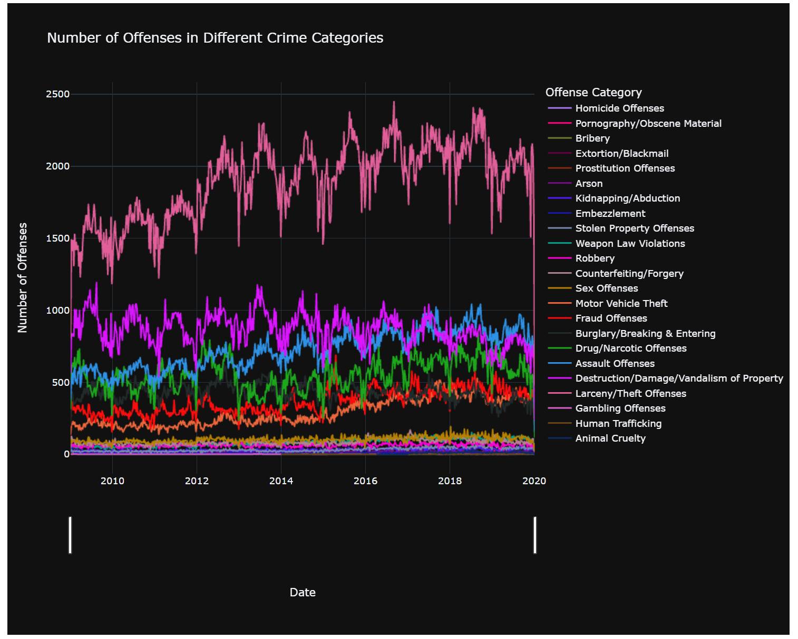

 The plot above indicates that Larceny/Theft crime category is the most abundant among all crime categories, followed by the Destruction/Damage/Vandalism of Property. 
It is quite vivid that almost all of the crime categories have a seasonal component to them. 
Most of the crime categories had a downturn during 2019—all but the Weapon Law Violations.  
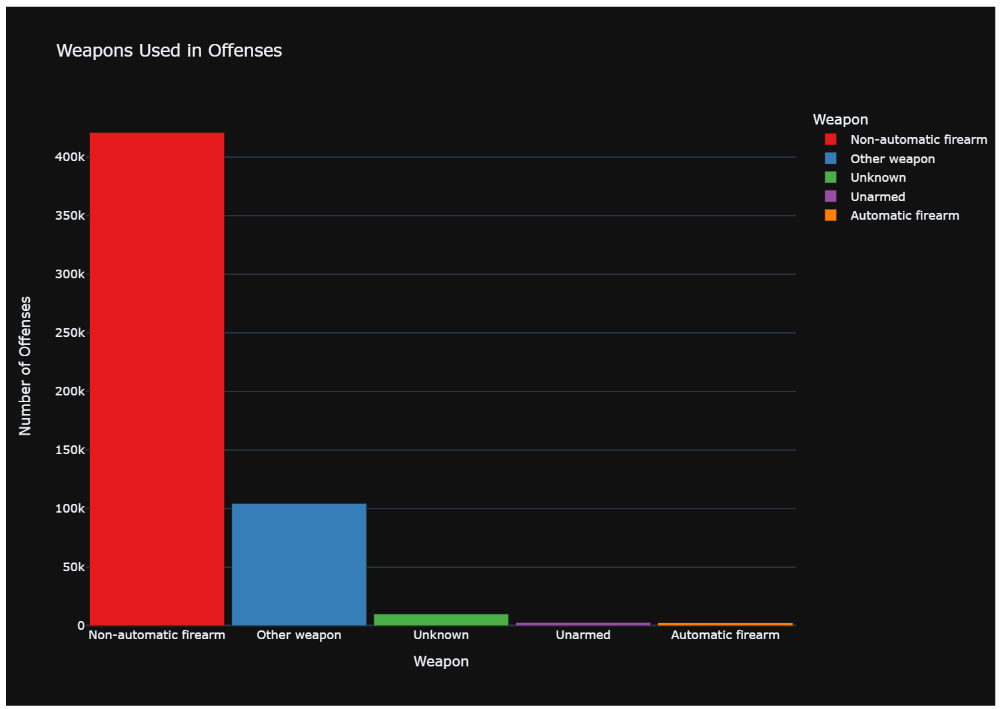

 The plot above indicates that most of the committed offenses involve non-automatic firearms. The plot does not include any of the offenses which by their nature could not have any weapon associated with them (like Fraud or Prostitution).   

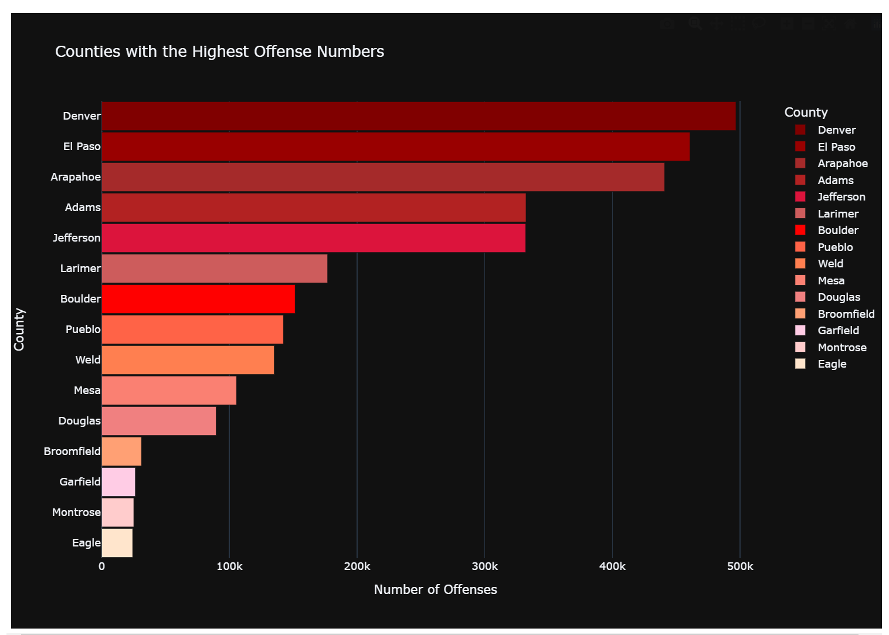

 The plot above indicates that the counties with the highest number of commited offenses are  
        1. Denver 
        2. El Paso 
        3. Arapahoe 
        4. Adams 
        5. Jefferson  
The rest of the counties are trailing significantly behind.  
It is worth mentioning that the plot reflects the overall number of offenses over ten years. The distribution of the number of offenses per country per each year could be slightly different than on the plot above.
   

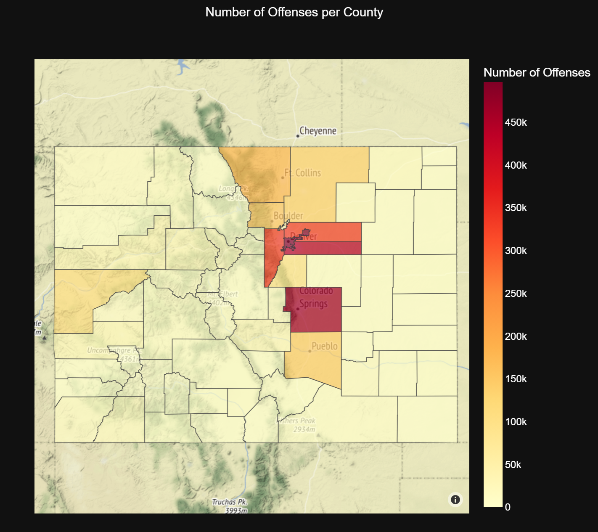

  The same information is being conveyed by the map above. All counties with high crime rates are colored darker; the continuous color scale is included. One can see that the order of the sequence is the same. The main advantage of presenting similar information on a map is giving a viewer better spatial perception.  

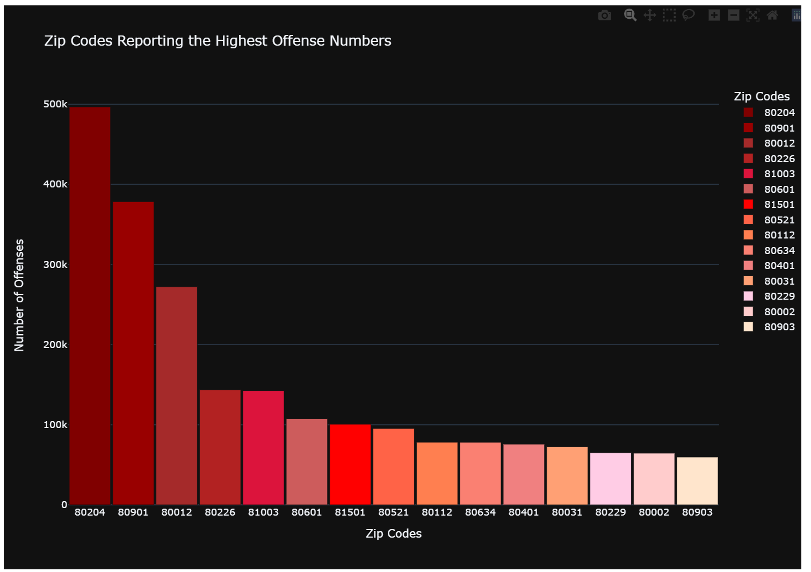

 The next plot displays the zip codes with the most offenses reported over the decade (2009-2019). The zip codes are ordered by the crime rate. However, it is worth mentioning that this information might be misleading because of the way law enforcement agencies report their data to the FBI. Zipcodes are associated not with the geographic location of an incident but rather with a reporting agency's geographic location, which accumulates the offense information for several zip codes where offenses occur.  

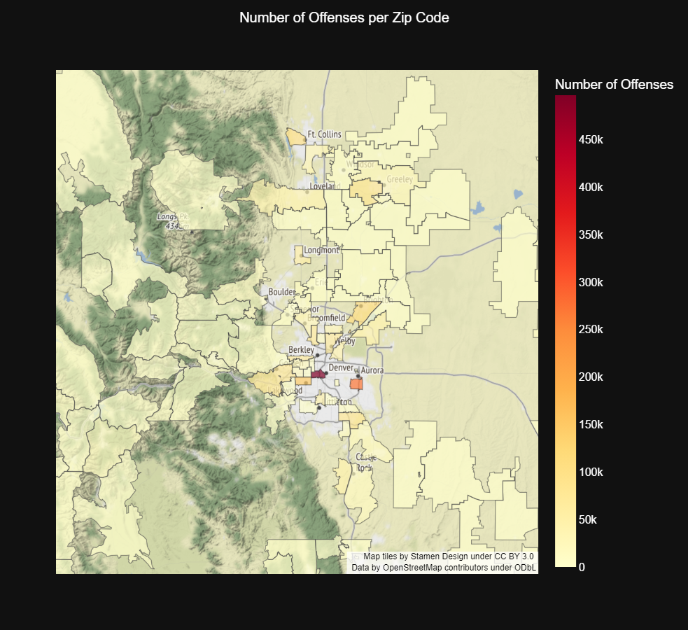

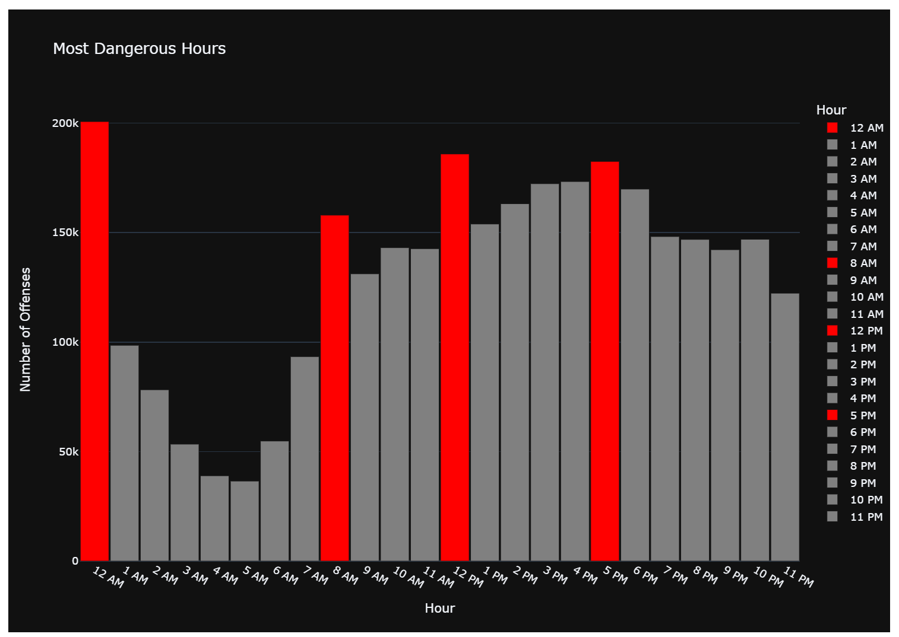

  Another interesting plot presents information on what time of a day the most offenses occur. While one might expect that "dark deeds occur in the middle of a night," and they sure do, midnight has a very prominent association with the most offenses committed. However, the other three peaks happen at 8 AM, 12 PM, and 5 PM. One can speculate that these are the rush hours when the public transportation is most crowded, providing the best opportunities for theft and larceny, the category that outpaces all other categories of offenses.  

## Exploratory analysis of the data specific to modeling

 Due to the sheer number of the records in the dataset it proved to be very time-consuming to model it. Therefore, I decided to limit the records to the last five years (2015-2019). Another reason to limit the dataset came from the fact that in 2019 the crime took a downturn. The only way to include this tendency into a training set of records was to limit the overall number of records and to use only 10% of them as a test dataset. 
Also, the original dataset with a count of daily offenses was resampled to a weekly count.
As a result, the training set had 262 weeks between 2015 and the middle of 2019, while the test set included 26 weeks of the second part of 2019.

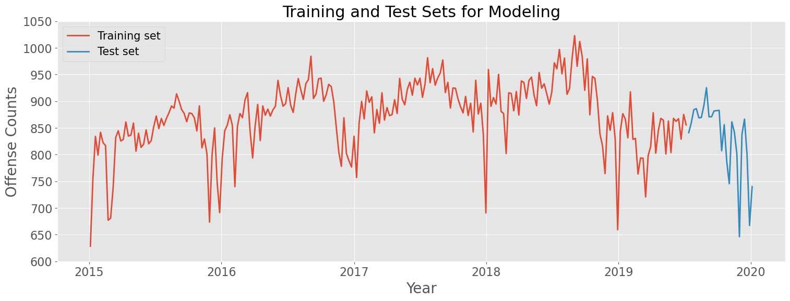

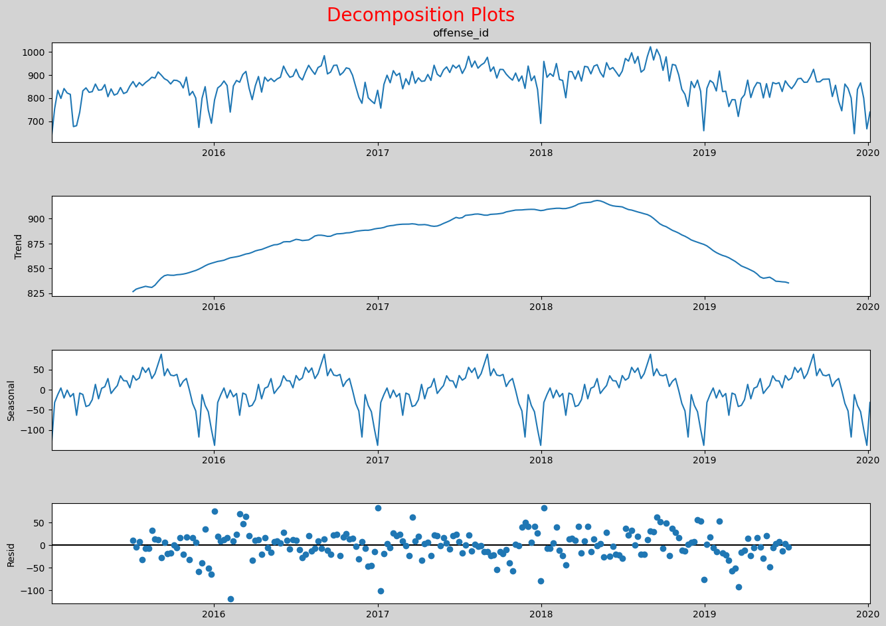

 The time-series clearly displays a trend and a seasonality components. The crime rate increases in the middle of a year and drops in cold months of a year especially noticeably around Thanksgiving and Christmas holidays.  

# Model&iNterpret

## Modeling of General Crime Rate

I have decided to build n ARIMA(3, 1, 0) model with only trend autocorrelation components and first differencing as a Baseline model. As expected, the model performed relatively well, picking up an average trend for the last year but failed to account for seasonality.  

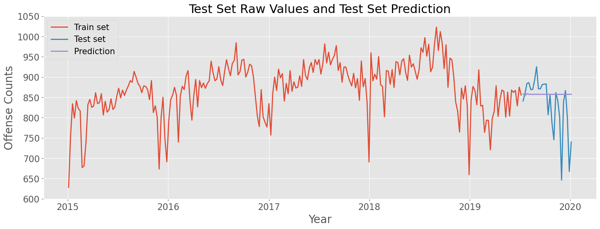

 Gridsearch for the best SARIMAX model suggested ARIMA(3, 1, 0)x(3, 1, 0, 52) combination that generated relatively good test results and a reasonable forecast for two years forward.  

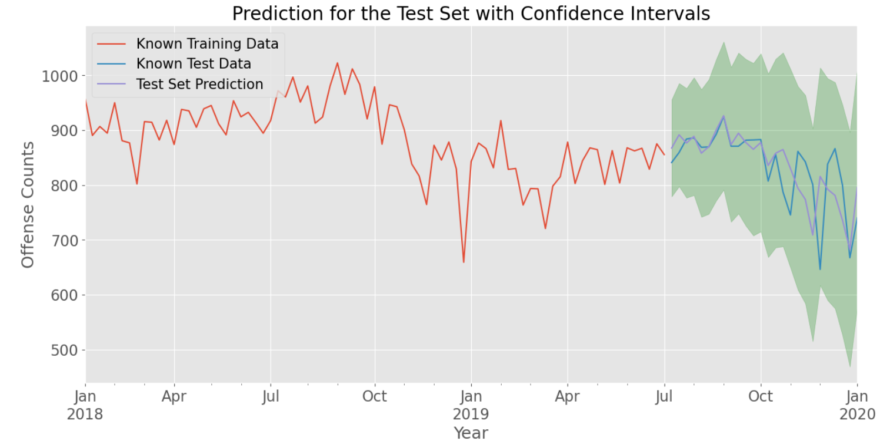

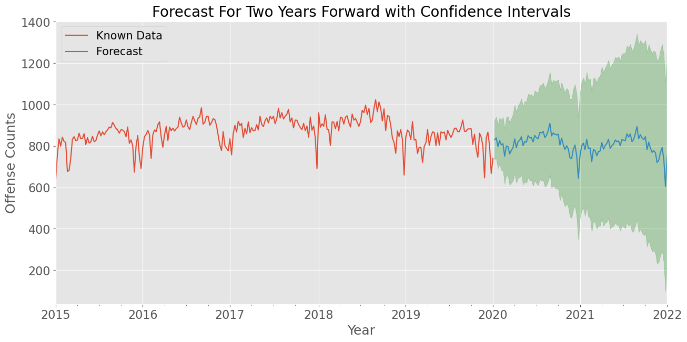

 Based on the fact that the crime rate seemingly had downturns around holiday season I included exogenous predictors (US holiday time-series) into the mode. However, I used the same best combination from the previous gridsearch of ARIMA(3, 1, 0)x(3, 1, 0, 52). The results of the testing and forecasting were virtually the same.  

The last step in the modeling of the general crime rate was using an auto-arima approach to search for the best combination of p,d,q and P,D,Q,d for ten and seasonal components of the time-series. The best model generated was a SARIMAX(1, 1, 1)x(2, 1, 0, 52) model. It displayed a relatively good fit with the test data and a   

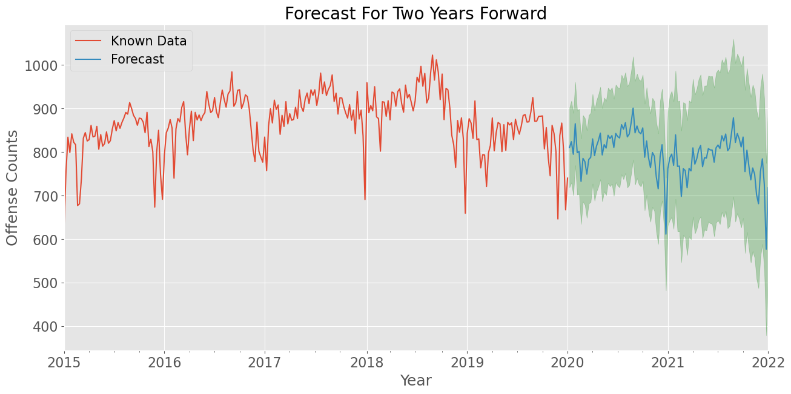

## Modeling of Crime Rate per Category

There are 23 separate crime categories in the original dataset. Some of them have sub-categories. But it has been decided to limit the analysis only to categories level.  

Various categories demonstrated significantly different stationarity, trend and seasonality characteristics. All categories were modeled using auto-arima grid search, tested, and two-year forecast for each category generated. The final result can be found in the saved pickle files at data/pickled_models/RESULTS1 and RESULTS2. Each file contains a category model along with a forecast plot. Due to the sheer volume of the data it's better to see the corresponding [notebook](capstone_project_part4.ipynb)  

# Conclusions

&ensp;&ensp;&ensp;&ensp;1.&ensp;&ensp;The project demonstrated that the real crime data could be analyzed and modeled with significant accuracy. 
&ensp;&ensp;&ensp;&ensp;2.&ensp;&ensp;It also demonstrated that the generated models could well predict future general crime rates and categories crime rates. 
&ensp;&ensp;&ensp;&ensp;3.&ensp;&ensp;The Exploratory Data Analysis depicted which geographic areas show higher crime rates and require more resources and preventive programs. 
&ensp;&ensp;&ensp;&ensp;4.&ensp;&ensp;The dataset, results of EDA, and the models are the base for a web-based dashboard built with dash python package.  

# Recommendations

&ensp;&ensp;&ensp;&ensp;1.&ensp;&ensp;The first recommendation is to obtain current data; it is difficult to forecast future trends with data almost two years old. 
&ensp;&ensp;&ensp;&ensp;2.&ensp;&ensp;Suppose dynamic data becomes available, build and an API. This approach would be the most helpful to the general public. 
&ensp;&ensp;&ensp;&ensp;3.&ensp;&ensp;Add exogenous predictors to the time-series to improve modeling performance. The most helpful predictors would be the socio-economic features of the geographic areas. 
&ensp;&ensp;&ensp;&ensp;4.&ensp;&ensp;Add geographic locations of committed offenses to improve knowledge of most crime-prone areas to plan for resources and preventive measures. 
&ensp;&ensp;&ensp;&ensp;5.&ensp;&ensp;Improve performance and quality of the web-based 'Crime in Colorado' application.  

## For any additional questions, please contact **Elena Kazakova @ e.v.kazakova@gmail.com**
